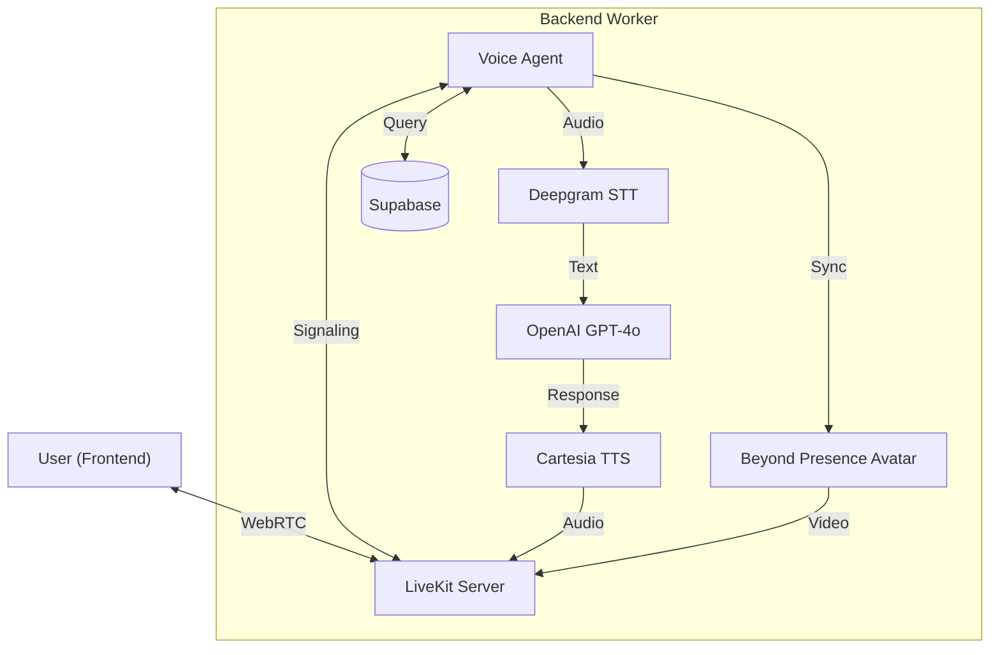

# Backend - Voice Agent with Avatar & Clinic Assistant

The backend powers the intelligence of the system, handling authentication, agent logic, STT/TTS pipelines, and database interactions.

## 🏗️ Architecture Components

1.  **API Server (`server.py`)**:
    *   FastAPI application.
    *   Authenticates users.
    *   Issues LiveKit access tokens.

2.  **Agent Worker (`main.py` & `agent.py`)**:
    *   Powered by `livekit-agents`.
    *   **STT**: Deepgram (Nova-2 model).
    *   **LLM**: OpenAI (GPT-4o).
    *   **TTS**: Cartesia (Sonic model).
    *   **Avatar**: Integration with "Beyond Presence".
    *   **Tools**: Custom database tools (`tools.py`) for booking/querying.

3.  **Database**:
    *   **Supabase (PostgreSQL)** for persisting users, appointments, and logs.

## � Backend Pipeline

The agent worker operates in an event-driven loop, coordinating multiple AI services.



## �🛠️ Setup & Configuration

### Prerequisites
*   Python 3.9+
*   Docker & Docker Compose (optional but recommended)
*   Supabase account and project.
*   API Keys: LiveKit, Deepgram, OpenAI, Cartesia, Beyond Presence.

### Environment Variables
Create a `.env` file in this directory (`backend/.env`):

```env
LIVEKIT_URL=wss://...
LIVEKIT_API_KEY=...
LIVEKIT_API_SECRET=...
DEEPGRAM_API_KEY=...
OPENAI_API_KEY=...
CARTESIA_API_KEY=...
SUPABASE_URL=...
SUPABASE_KEY=...
BEY_API_KEY=...
```

### Local Execution (Without Docker)

1.  Install dependencies:
    ```bash
    pip install -r requirements.txt
    ```

2.  Start the API Server:
    ```bash
    uvicorn server:app --host 0.0.0.0 --port 8000 --reload
    ```

3.  Start the Agent Worker:
    ```bash
    python main.py start
    ```

## 🐳 Docker Deployment

To deploy the backend services using Docker Compose (run from the `backend` directory):

```bash
docker-compose up --build -d
```

This starts both the API server (port 8000) and the Worker process.
